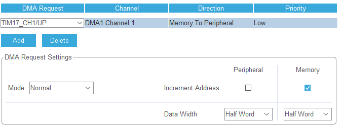

# overview

Features

- Non Stop (DMA + Interrupt)
- Fast
- Easy Usage

# Before Use

## Clock Config


## Pins


## Timer
  

**Note**  
Counter Period = (1.25us * 40MHz) - 1  
change 40MHz with your micro controller frequency


## DMA


**I Used Timer 1, Channel 1 in this exmaple**  
in main.c  
[this function going to call when DMA finishes]
```c
    void HAL_TIM_PWM_PulseFinishedCallback(TIM_HandleTypeDef *htim)
    {
    	if (htim->Instance == TIM1) {
    		HAL_TIM_PWM_Stop_DMA(&htim1, TIM_CHANNEL_1);
    			WS2812_DMACallBack();
    	}
    }
```

# How to Use  

initialize at first
```c
WS2812_init();
```

define colors
```cpp
WS2812_colorStruct myColor = (WS2812_colorStruct) {10, 10, 10};
```

now enjoy light up LEDs
```c
WS2812_setAll(myColor);
WS2812_refresh(htim1, TIM_CHANNEL_1);
```

# Functions
```c
// general
void WS2812_init(void);
void WS2812_DMACallBack(void);

// update led colors
void WS2812_refresh(TIM_HandleTypeDef, uint32_t);

// set color
void WS2812_setAll(WS2812_colorStruct);
void WS2812_setOne(WS2812_colorStruct, int);
void WS2812_clearAll(void);
void WS2812_shiftNext(WS2812_colorStruct);
void WS2812_shiftPrevious(WS2812_colorStruct color);
void WS2812_rotateNext(void);
void WS2812_rotatePrevious(void);
```

# In Practice


# Change Driver Config
**WS2812.h**  
modify these configs, based on your needs  

**Note**  
for example for 48MHz, round the numbers. but these rounding can cause some glitches (some colors displacements) 
```c
#define __WS2812_LEDsCount	3
#define __WS2812_ZeroTime 	16	// 0.4us * 40MHz
#define __WS2812_OneTime	32	// 0.8us * 40MHz
```

# Exmaple
refer to example folder
(this based on STM32F103C8)